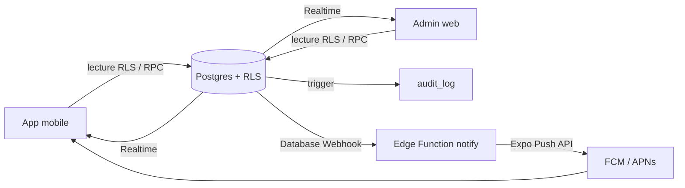

# Plan de travail – Heute v0.1

Plan établi à partir de [road.md](road.md) le 29.09.2026. Pas de code ici : ce document fixe l'ordre, les décisions et les critères de fin de chaque tâche.

**Usage** : une tâche (`Px-yy`) = une session de travail = une PR courte. Cocher la case quand la *Definition of Done* (§8) est remplie. Qui fait quoi et quand : §6.6.

---

## 1. Compréhension

Remplacer les plans papier de la réception par un écran « Heute » mobile mis à jour en temps réel, plus une admin web. Prototype démontrable devant la Herbergsleitung, publié sur GitHub avec données fictives.

- **Équipe** : 3 agents IA (A : Claude Sonnet 5.5 pour le backend et l'admin ; L et U : deux Gemini 3.8 Flash pour la logique et l'UI mobiles), orchestrés par un humain (§6.6).
- **Critère de succès** : le scénario de démo en 5 étapes (road.md) passe de bout en bout sur de vrais téléphones.
- **Stratégie** : lever les risques techniques d'abord (push, RLS), puis livrer par tranches qui tournent sur téléphone, en ne construisant que ce que la démo et les « Must » exigent. Des contrats typés (A→L, L→U) permettent aux trois agents d'avancer en parallèle.

---

## 2. Analyse du cahier des charges

### 2.1 Incohérences et trous à corriger avant de coder

| # | Constat | Conséquence | Correction retenue |
|---|---|---|---|
| A1 | L'Änderungsprotokoll doit montrer « toutes les modifications » (démo étape 5 : service + repas + chambres), mais seul `shift_changes` existe | Impossible de tracer repas et tâches | Table **`audit_log` générique** (remplace `shift_changes`), alimentée par un seul trigger sur `shifts`, `meal_counts`, `menu_items`, `room_tasks` |
| A2 | Démo étape 3 (« chiffre surligné » + push Küche) repose sur VG-05 et NT-03, classés *Should* | La démo échoue si on s'en tient aux Must | VG-05 (version minimale) et NT-03 **promus Must** |
| A3 | Critère d'acceptation « total IST o. Pause d'un mois » repose sur DP-05, classé *Should* | Critère non vérifiable | DP-05 **promu Must** |
| A4 | « abwesend » pour les collègues : RLS filtre des **lignes**, pas des **valeurs** | Un collègue lisant `shifts` verrait `krank` | Les non-admins lisent l'équipe via une **fonction de masquage** `team_shifts(day)` ; `shifts` direct = ses propres lignes seulement |
| A5 | Housekeeping « modifie le statut de ses tâches » : RLS ne restreint pas les **colonnes** | Un employé pourrait changer `assigned_to` | Écriture du statut via **RPC** `set_task_status()` ; UPDATE direct réservé à l'admin |
| A6 | Küchenleitung modifie menu + Dienstplan Küche, mais aucun écran mobile d'édition | Pas d'interface pour ce rôle | Küchenleitung accède à l'admin web avec un périmètre réduit (garanti par RLS) |
| A7 | Lien magique : le SMTP par défaut de Supabase est très limité et les e-mails fictifs ne reçoivent rien | Connexion impossible pendant la démo | Démo = **e-mail + mot de passe** (comptes seedés). Lien magique/OTP = *Should* (SMTP dédié + deep link). PIN = hors v0.1 |
| A8 | « Test immédiat avec Expo Go » : Expo Go ne gère plus les push distants sur Android depuis le SDK 53 (à revérifier pour le SDK courant) | NT-01/02 impossibles dans Expo Go Android | **Development build EAS** dès la phase 0 ; iOS via Expo Go = best effort (§10, R2) |
| A9 | `room_tasks.zone` (Bäder, Schlafzimmer) sans chambre | `room_id` obligatoire bloque les tâches de zone | `room_id` nullable + contrainte `room_id IS NOT NULL OR zone IS NOT NULL` |
| A10 | `shift_changes.shift_id` en clé étrangère | Supprimer un service efface ou casse son historique | `audit_log` stocke un instantané (`row_id`, `old`, `new`) sans FK en cascade |
| A11 | `allergy_note` en texte libre | Risque qu'un nom d'enfant y soit saisi (donnée art. 9) | **`allergies jsonb`** : code allergène (14 allergènes UE + `sonstige`) → nombre. Les consignes réelles de la colonne Info (« 1× Nudeln/Müsli », « 18:00 Grillen ») vont dans une `note` courte (≤ 120 caractères) avec l'avertissement « keine Namen, keine Diagnosen » |
| A12 | Données seed à dates fixes | Le jour de la démo, « Heute » est vide | Seed en **dates relatives** à `current_date` |
| A13 | Inscription publique active par défaut dans Supabase | N'importe qui devient `authenticated` avec la clé publique | Inscriptions désactivées + toutes les policies exigent une ligne `employees` active |
| A14 | Annonces sur l'écran Heute, mais NT-04 = *Could* | Section vide | Section masquée en v0.1 |
| A15 | Sur l'export, LP est compté dans la colonne Mittag et GR dans Abend, chacun avec son propre détail MOS/VEG | LP et GR sont des variantes de repas, pas des repas | On garde l'enum du cahier (`lunchpaket` et `grill` = lignes distinctes, chacune avec son détail de régimes) ; `mittag` = repas chauds uniquement. Affichage « Mittag 38 · Lunchpakete 80 » (sémantique à confirmer, Q8) |
| A16 | L'export contient aussi Vormittag et Nachmittag, vides sur tous les échantillons | – | Non modélisés en v0.1 ; ajout possible par une migration de l'enum |
| A17 | Le Speiseplan couvre seulement Mittag et le « Warmanteil » de l'Abend ; certaines variantes veg sont vides (Pizza) | – | `menu_items.meal` ∈ {mittag, abend} ; `veg_variant` et `dessert` nullable |

### 2.2 Ce que confirment les documents papier (photos du 29.09)

- **Dienstplan Excel** :
  - chaque personne occupe 4 lignes : début, fin, Bemerkung, IST o. Pause ;
  - en-tête : Datum, Wochentag, Feiertage ;
  - contrat VZ : 174 h/mois, 8,00 h/jour.
- **Horaires réels** : toujours une amplitude de 8,5 h (06:00–14:30, 06:45–15:15, 08:00–16:30, 10:30–19:00, 11:30–20:00, 12:00–20:30), soit IST = 8,00 h. La règle des −30 min est confirmée.
- **Codes de la ligne Bemerkung** : `u` = 8,00, `x` = 0,00, `SEM` = 8,00, dimanche = 12,00. **`k` = 0,00 dans l'Excel** (Q3).
- **TD** : le Teildienst est ajouté à la main (8–13 + 18–20:30/21). Avec fin à 21:00, on obtient 8,00 h sans pause déduite, d'où l'hypothèse : pas de pause pour le TD (Q2).
- **Liste Gäste** (export du logiciel de réservation) :
  - colonnes : Datum, Matchcode/Reg.Nr., Art (MOS, VEG, LP, GR, AL), Früh, Vormittag, Mittag, Nachm., Abend, Info ;
  - lignes « Summe » par jour et « Gesamtsumme » ;
  - le personnel surligne surtout les Summe et les LP, donc l'écran Küche commence par le total du jour.
- **Versions concurrentes** : plusieurs versions horodatées de la liste sont affichées en même temps (« 22.09.26 12:04 », « 28.09.26 09:46 »), avec des chiffres différents. C'est exactement ce que corrigent l'affichage « Stand » et VG-05.
- **Notes de cuisine** : quantités par plat selon le nombre de couverts, fiche recette. Elles confirment un besoin réel pour SP-03, premier *Could* après la v0.1.
- **Besoin en personnel** : l'en-tête du Dienstplan calcule un « Bedarf Reinigungspersonal » par jour. Mis au backlog, après l'import des réservations.

### 2.3 Budget

Le périmètre Must + démo représente **≈ 60 h** de travail à l'échelle d'un développeur. Les heures servent désormais à **dimensionner** les tâches : avec des agents, la contrainte réelle est le **temps de l'orchestrateur** (relecture, tests sur le S23, secrets). Le calendrier suit les vagues du §6.6, et le Jalon 2 reste visé en fin de semaine 4.

Le **chemin critique** passe par A en vagues 1–2 : le contrat de données, puis `team_shifts` et RLS. Les coupes du §10.2 restent prêtes si le calendrier glisse.

---

## 3. Décisions d'architecture

Chaque décision importante fait l'objet d'un ADR court dans `docs/adr/` (P0-01).

| # | Décision | Pourquoi | Trade-off |
|---|---|---|---|
| D1 | Stack du cahier conservée : Supabase (Frankfurt), Expo + TypeScript, Next.js | Android **et** iOS avec un seul code ; iOS compilé dans le cloud (EAS Build) sans Mac ; règles métier partagées en TypeScript avec l'admin. Alternatives écartées : Kotlin/Compose natif (Android seulement, iOS = 2ᵉ app en Swift), Kotlin Multiplatform + Compose Multiplatform (Mac + Xcode obligatoires pour iOS, règles métier dupliquées côté admin), Flutter (même contrainte Mac, 3ᵉ langage) | Dépendance forte à Supabase et à Expo (acceptable pour un prototype). Le développeur maîtrise React et Next.js : seuls les écarts React Native restent à apprendre (primitives, styles, EAS) |
| D2 | Monorepo **npm workspaces**, sans Turborepo/Nx | 3 paquets : un orchestrateur n'apporte rien ; npm est livré avec Node ; le layout hoisté évite les soucis de Metro | Installations plus lentes que pnpm |
| D3 | Un seul paquet partagé : `packages/domain`, pur (sans React ni client Supabase). Il contient : types DB générés ; constantes et libellés (codes de service, repas, régimes, allergènes) ; règles de temps ; validation des saisies (mêmes invariants que les CHECK SQL) ; capacités par rôle ; traduction des erreurs RPC en messages | Ce sont les mêmes concepts côté mobile et admin : une seule implémentation testée | Les requêtes Supabase restent dans chaque app, car elles diffèrent. L'Edge Function (Deno) n'importe pas ce paquet : duplication minime assumée (formatage HH:MM) |
| D4 | **Lectures** : tables et vues protégées par RLS. **Écritures métier** : RPC Postgres (`save_shift`, `delete_shift`, `set_task_status`) | Raison obligatoire, périmètre par rôle et restriction de colonnes garantis côté serveur, en un seul endroit | Un peu de SQL à tester (pgTAP) |
| D5 | `audit_log` générique rempli par trigger ; raison passée par `set_config('app.reason', …, true)` dans la RPC ; aucun droit d'écriture utilisateur | Traçabilité inviolable, un seul mécanisme pour 4 tables | La raison n'est exigée que pour `shifts` |
| D6 | Masquage et agrégats via fonctions `SECURITY DEFINER` (`team_shifts`, `meal_totals`) avec `search_path` fixé | Seul moyen propre de montrer « abwesend » et des totaux sans exposer le détail | Pas de Realtime sur ces fonctions → rafraîchissement au retour sur l'écran |
| D7 | Realtime = **signal d'invalidation** (refetch), jamais source de données | Une seule voie de lecture, pas de fusion de cache à maintenir | Un aller-retour réseau de plus par événement (négligeable à 10 utilisateurs) |
| D8 | État séparé par nature, **sans store global** : serveur = TanStack Query (+ persistance AsyncStorage) ; session = Supabase Auth (stockage sécurisé) ; réseau = NetInfo branché sur `onlineManager` ; préférences et « dernière vue » = AsyncStorage ; UI = état local | Chaque catégorie a une seule source de vérité. TanStack Query gère loading/error/stale/refetch et la lecture hors ligne sans code maison | 4 dépendances, justifiées par l'exigence hors ligne |
| D9 | Admin Next.js **en mode client** (supabase-js navigateur, pas de SSR de données ni de Server Actions) | Même modèle d'accès aux données que le mobile ; évite la gestion des cookies d'auth SSR | On n'exploite pas le rendu serveur (inutile derrière un login) |
| D10 | Temps en **minutes depuis minuit** (`smallint`), dates locales `date` en Europe/Berlin, pas de service traversant minuit en v0.1 | Pas d'erreur de décimales ; pas de problème de changement d'heure en journée | Services de nuit hors périmètre |
| D11 | Textes dans un dictionnaire typé `de.ts`, sans bibliothèque i18n | Une seule langue en v0.1 ; les textes sont déjà extraits | Passage à i18next le jour où une 2ᵉ langue arrive |
| D12 | UI admin : **une seule** bibliothèque de composants accessibles (recommandation : Mantine) ; UI mobile : composants RN maison (5–6) | Vitesse sur l'admin ; le mobile a peu de composants | Dépendance UI côté admin |

---

## 4. Architecture

### 4.1 Arborescence

```
heute/
├─ apps/
│  ├─ mobile/                 Expo + expo-router
│  │  └─ src/
│  │     ├─ app/              routes : les écrans composent des features
│  │     ├─ features/         today · shifts · team · kitchen · tasks · profile
│  │     │  └─ <feature>/     api.ts (requêtes + mapping) · hooks.ts · components/
│  │     ├─ components/ui/    composants partagés (voir docs/design/)
│  │     └─ lib/              supabase · query · realtime · push · strings/de.ts · theme
│  └─ admin/                  Next.js, données côté client
│     └─ src/
│        ├─ app/              routes
│        ├─ features/         dienstplan · gaeste · speiseplan · housekeeping · protokoll
│        └─ lib/              supabase · query · auth-guard
├─ packages/
│  └─ domain/                 database.types.ts (généré) · codes · time · validation · roles · errors
├─ supabase/
│  ├─ migrations/             schéma · RLS · fonctions · triggers · webhooks
│  ├─ tests/                  pgTAP (RLS, audit, RPC)
│  ├─ functions/notify/       Edge Function (Deno)
│  └─ seed.sql
├─ docs/adr/                  décisions
├─ docs/agents/               briefs : admin.md · mobile-logic.md · mobile-ui.md
├─ docs/design/               charte mobile : README · tokens · components · screens · copy · a11y
├─ road.md · PLAN.md · README.md · AGENTS.md · CLAUDE.md · GEMINI.md
```

**Sens des dépendances** : `apps/* → packages/domain → rien`. Les apps ne s'importent jamais entre elles. `packages/domain` ne connaît ni React ni Supabase (hormis les types générés).

### 4.2 Flux



- **Lecture** : écran → hook TanStack Query → supabase-js → PostgREST → RLS → cache persistant (affiche « Stand: HH:MM »).
- **Écriture métier** : admin → RPC (validation, périmètre du rôle, raison) → table → trigger d'audit.
- **Temps réel** : changement → Realtime (filtré par RLS) → invalidation → refetch.
- **Push** : changement → webhook → `notify` → destinataires + tokens → Expo Push (priorité haute).

### 4.3 Écrans mobiles par rôle

| Onglet | Admin | Küchenleitung | Küche | Housekeeping/BFD |
|---|---|---|---|---|
| Heute | ✓ | ✓ | ✓ | ✓ |
| Dienstplan | ✓ | ✓ | ✓ | ✓ |
| Team | ✓ | ✓ | ✓ | ✓ |
| Aufgaben | – | – | – | ✓ |
| Küche | ✓ | ✓ | ✓ | – |
| Profil | ✓ | ✓ | ✓ | ✓ |

« Heute » compose les hooks existants des features (pas d'endpoint dédié). Si l'écran dépasse 2 s en 4G (mesure en P2-07), on passera à une RPC `today()` unique.

---

## 5. Modèle de données révisé

Seuls les **écarts** par rapport à road.md sont listés.

- **Enums Postgres** : `department`, `app_role`, `shift_type`, `meal`, `task_type`, `task_status`.
- **`employees`** : `user_id` unique → `auth.users`.
- **`shifts`** :
  - unique `(employee_id, date)` ;
  - heures `smallint` 0–1440, `end > start` ;
  - `start2`/`end2` renseignés ensemble et uniquement pour `td` ;
  - pas d'heures pour `urlaub`/`krank`/`frei` ;
  - `break_min` à 30 par défaut.
- **`audit_log`** (remplace `shift_changes`) : `table_name`, `row_id`, `action`, `old jsonb`, `new jsonb`, `changed_by`, `changed_at`, `reason`, plus `employee_id` et `date` dénormalisés pour filtrer. Aucune policy d'écriture ; INSERT uniquement par le trigger `SECURITY DEFINER`.
- **`meal_counts`** :
  - unique `(booking_id, date, meal)` ;
  - `allergy_count` + `allergy_note` remplacés par `allergies jsonb` (code → nombre, validé par un CHECK) et une `note` courte (colonne Info) ;
  - `lunchpaket` et `grill` sont des lignes distinctes (A15).
- **`menu_items`** : `meal` ∈ {mittag, abend}, unique `(date, meal)`, `veg_variant` et `dessert` nullable.
- **`room_tasks`** : `room_id` nullable (voir A9) ; index `(date, assigned_to)`.
- **`push_tokens`** : `token` unique.
- **Index** : `shifts(date)`, `meal_counts(date)`, `audit_log(changed_at desc)`.
- **`updated_at`** : maintenu par trigger (extension `moddatetime`).

### 5.1 Matrice d'accès (RLS + fonctions)

| Objet | Admin | Küchenleitung | Küche | Housekeeping/BFD |
|---|---|---|---|---|
| `employees` | R/W | R (Küche) + soi | R soi | R soi |
| `shifts` | R + RPC | R Küche + RPC Küche | R soi | R soi |
| `team_shifts(day)` | motif visible | « abwesend » | « abwesend » | « abwesend » |
| `audit_log` | R | – | – | – |
| `bookings`, `meal_counts` | R/W | R | R | – |
| `meal_totals(from, to)` | ✓ | ✓ | ✓ | ✓ |
| `menu_items` | R/W | R/W | R | R |
| `rooms` | R/W | – | – | R |
| `room_tasks` | R/W | – | – | R soi + RPC statut |
| `announcements` | R/W | R (audience) | R (audience) | R (audience) |
| `push_tokens` | soi | soi | soi | soi |

Toutes les policies passent par des helpers `current_employee_id()` / `current_app_role()` (`SECURITY DEFINER`, `STABLE`, `search_path` fixé). Un utilisateur authentifié sans ligne `employees` active ne voit rien.

---

## 6. Plan par phases

Les phases regroupent les tâches par sujet. Estimations en heures (± 30 %). La répartition entre agents et les vagues sont au §6.6.

### Phase 0 — Fondations et levée des risques · 8,5 h

Objectif : prouver dès la semaine 1 que le push fonctionne sur un vrai téléphone, app fermée.

- [ ] **P0-01** (0,5 h) Vérifier sur les docs officielles les versions stables actuelles (Node LTS, Expo SDK, Next.js, Supabase CLI, supabase-js), le support du push dans Expo Go et le type de clé publique Supabase (`anon` ou `publishable`). Rédiger ADR 0001 (stack et versions) et reporter D1–D12 en ADR courts.
- [ ] **P0-02** (1,5 h) Initialiser le dépôt :
  - `git init` et `.gitignore` (env, builds, `google-services.json`, dossier `private/`) ;
  - `CODEOWNERS` (§6.6) et protection de `main` : CI verte obligatoire, relecture obligatoire pour les PR qui touchent le contrat ;
  - npm workspaces, `tsconfig` de base strict, ESLint + Prettier partagés ;
  - LICENSE, README squelette ;
  - **`AGENTS.md`** (principes condensés, conventions, DoD, protocole du §6.6), importé par `CLAUDE.md` et `GEMINI.md` ; briefs `docs/agents/*.md`. Ce point est rédigé par l'orchestrateur en vague 0.
- [ ] **P0-03** (1 h) Supabase : `supabase init`, stack locale (Docker), projet cloud **région Frankfurt**, **inscriptions désactivées**, `.env.example`.
- [ ] **P0-04** (1 h) Squelette mobile (create-expo-app, TypeScript, expo-router) dans le workspace. Vérifier la résolution Metro en monorepo. Lancement sur un téléphone Android.
- [ ] **P0-05** (2,5 h) **Spike push** (risque n°1) :
  - projet EAS, credentials FCM V1 (secret hors dépôt), development build Android ;
  - `expo-notifications` : permission Android 13+, canal Android, obtention du token ;
  - envoi manuel via l'outil Expo Push, mesure du délai app fermée sur le **Samsung S23 (Android 16)**, en vérifiant l'effet de l'optimisation de batterie Samsung (« applications en veille ») ;
  - iOS : pas de test du push dans Expo Go. Le push iOS passe uniquement par une development build EAS, qui exige le compte Apple Developer (achat à décider avant la semaine 5) ;
  - consigner le résultat (ADR 0002).
- [ ] **P0-06** (0,5 h) Squelette admin Next.js déployé sur Vercel (valide la chaîne de déploiement).
- [ ] **P0-07** (1,5 h) CI GitHub Actions : install, typecheck, lint, test, et vérification que `database.types.ts` correspond aux migrations (garde-fou du contrat A↔L). Contrôle des budgets de contexte (§6.6) : un script de quelques lignes qui mesure la taille de `AGENTS.md`, `docs/agents/` et `docs/design/`. Activer secret scanning et push protection.

**Livrable** : app vide sur téléphone qui reçoit un push de test en moins de 5 s app fermée ; admin vide en ligne ; CI verte.

**Go / No-go** : si le push Android échoue, c'est traité avant toute autre fonctionnalité.
### Phase 1 — Backend et domaine · 12,5 h

Objectif : une base complète, sécurisée et testée, rechargeable en une commande.

- [ ] **P1-01** (2,5 h) Migration schéma : enums, 10 tables (§5), contraintes, index, trigger `updated_at`.
- [ ] **P1-02** (0,5 h) Helpers `current_employee_id()`, `current_app_role()`.
- [ ] **P1-03** (1,5 h) Policies RLS selon la matrice §5.1, RLS activée sur **toutes** les tables.
- [ ] **P1-04** (1 h) Fonctions `team_shifts(day)` (masquage `urlaub`/`krank` → `abwesend`, pas de `note`) et `meal_totals(from, to)`. *DP-02, VG-01*
- [ ] **P1-05** (2 h) Écritures et audit. *DP-03, DP-04, HK-03*
  - RPC `save_shift` : raison obligatoire, périmètre Küchenleitung = Küche ;
  - RPC `delete_shift(id, reason)` et `set_task_status(id, status)` (assigné uniquement ; `done_at` renseigné automatiquement) ;
  - trigger d'audit générique sur les 4 tables ;
  - `audit_log` sans droit d'écriture utilisateur.
- [ ] **P1-06** (1,5 h) Tests pgTAP (`supabase test db`). *Critère d'acceptation RLS* Un employé Küche :
  - ne lit pas le motif d'une absence ;
  - ne modifie pas un service.

  Et en plus :
  - Housekeeping ne modifie que le statut de ses tâches ;
  - `audit_log` est non modifiable ;
  - `save_shift` sans raison est refusé ;
  - un utilisateur sans ligne `employees` ne voit rien.
- [ ] **P1-07** (2 h) `seed.sql` en **dates relatives** :
  - Jugendherberge Musterberg : 40 chambres sur 4 étages ;
  - 8 employés fictifs avec comptes de démo ;
  - un mois de Dienstplan couvrant TD, SEM, u, k, x et un dimanche ;
  - 5 groupes et régimes (VEG, vegan, MOS, 2 allergies), un jour sans Mittag, un jour avec Lunchpakete ;
  - menu d'une semaine, ≈ 15 tâches par jour ;
  - Abendessen à 13 le jour J (démo étape 3) ;
  - structure calquée sur les documents papier, avec des valeurs et des noms **inventés** :
    - Matchcodes fictifs au format `NOM/NUMÉRO` (`MUSTERSCHULE/40001`), catégories `Einzelgäste_27+` et `Familien` ;
    - horaires réels à 8,5 h d'amplitude ;
    - un jour avec 80 Lunchpakete, un Grillen à 18:00, une consigne « 1× Nudeln/Müsli » ;
    - plats inspirés du Speiseplan affiché.
- [ ] **P1-08** (1,5 h) `packages/domain` : script `supabase gen types`, puis les fonctions pures suivantes. *DP-05*
  - `workedMinutes(shift)` : amplitude − pause ; TD = somme des 2 plages sans pause (Q2) ; SEM/Urlaub = 480 ; frei = 0 ; krank = constante (0 dans l'Excel, Q3) ; dimanche × `SUNDAY_FACTOR` (1,5) ;
  - `monthBalance(shifts, contract)` ;
  - `formatHHMM`, `formatHours` ;
  - tests Vitest, dont un **mois fictif** saisi dans le modèle Excel actuel : sa ligne « IST o. Pause » sert de résultat attendu (fixture = critère d'acceptation).

**Livrable** : `supabase db reset` reconstruit tout ; tests pgTAP et Vitest verts ; migrations poussées sur le cloud.
### Phase 2 — Mobile en lecture · 12,5 h → Jalon 1

Objectif : démo étape 1 sur un vrai téléphone.

- [ ] **P2-01** (3,5 h) Socle de l'app, selon [docs/design/](docs/design/README.md) :
  - client Supabase centralisé : session en stockage sécurisé (SecureStore est limité en taille : suivre le pattern de la doc Supabase RN), rafraîchissement lié à AppState, `fetch` avec timeout ;
  - TanStack Query + persistance ; retry automatique pour les lectures seulement ; NetInfo branché sur `onlineManager` ;
  - `strings/de.ts`, tokens du thème et composants `components/ui/` (docs/design/tokens.md et components.md) ;
  - composant `Screen` qui gère loading / empty / error / offline / unauthorized (session expirée → Anmeldung) + « Stand: HH:MM » ;
  - configuration de l'app : `android.allowBackup: false` ; aucun log de token ni de donnée personnelle.
- [ ] **P2-02** (1 h) Anmeldung : e-mail + mot de passe, garde de navigation, déconnexion, message d'erreur clair.
- [ ] **P2-03** (1 h) Onglets par rôle (§4.3).
- [ ] **P2-04** (2 h) Mein Dienstplan : semaine et mois, types lisibles, Soll/IST via `domain`. *DP-01, DP-05*
- [ ] **P2-05** (1 h) Team : `team_shifts(today)` groupé par équipe (Küche, Housekeeping, BFD). *DP-02*
- [ ] **P2-06** (2 h) Küche :
  - en tête, le total du jour (comme les lignes « Summe » surlignées) : Früh, Mittag, Abend + LP, GR, MOS, VEG, vegan, AL ;
  - détail par Matchcode avec VEG, vegan, MOS, AL, LP, GR ;
  - « kein Mittagessen / kein Abendessen » bien visible ;
  - menu avec variante veg et Nachspeise ;
  - rappel « Änderungen vorbehalten – bei Allergien Küchenpersonal fragen ».

  *VG-01..03, SP-01, SP-02*
- [ ] **P2-07** (1,5 h) Heute : mon service, mes tâches, Gäste du jour, menu. **Mesurer** le chargement en 4G (profil réseau Android) : objectif < 2 s, et < 10 s pour lire toute l'info.
- [ ] **P2-08** (0,5 h) Aufgaben en lecture : chambres du jour, étage, type Abreise/Bleiber. *HK-01*

**Jalon 1** : un employé fictif se connecte et lit service, équipe, Gäste et menu ; hors ligne, le dernier état reste lisible.
### Phase 3 — Admin web · 12,5 h

Objectif : toutes les écritures Must depuis l'admin, visibles sur mobile.

- [ ] **P3-01** (2 h) Socle admin : client Supabase, TanStack Query, bibliothèque UI, layout, login, navigation filtrée par rôle (admin, Küchenleitung). La sécurité reste assurée par RLS.
- [ ] **P3-02** (3 h) Dienstplan : grille mois × personnes en table HTML, calquée sur l'Excel (en-tête Datum / Wochentag ; par personne : horaires, Bemerkung, IST o. Pause) ; totaux IST/Soll par personne via `domain`. *DP-03, DP-05*
- [ ] **P3-03** (2 h) Édition d'une cellule : dialogue avec type, horaires, 2ᵉ plage TD et **raison obligatoire** → `save_shift`. Les erreurs serveur sont traduites en messages lisibles. *DP-03, DP-04*
- [ ] **P3-04** (1,5 h) Änderungsprotokoll : `audit_log` filtrable (période, table, personne, auteur), diff ancien → nouveau lisible. *DP-04, démo étape 5*
- [ ] **P3-05** (1,5 h) Gäste & Verpflegung : saisie par groupe et par repas pour une date. Les groupes sont créés par seed ou Studio en v0.1. *VG-01..03*
- [ ] **P3-06** (1 h) Speiseplan : saisie de la semaine (jour × repas). *SP-01*
- [ ] **P3-07** (1,5 h) Housekeeping : tâches du jour, attribution par sélection (multi-select), statut en couleur **et** texte. *HK-01, HK-02*

Reportés en *Should* : Tagesübersicht, écran Mitarbeiter (via Studio en v0.1), glisser-déposer, copie de semaine.
### Phase 4 — Temps réel, tâches, notifications · 10,5 h → Jalon 2

Objectif : scénario de démo complet.

- [ ] **P4-01** (1,5 h) Realtime mobile : `shifts` (moi), `room_tasks` (moi), `meal_counts`, `menu_items` → invalidation. Refetch au retour au premier plan et à la reconnexion.
- [ ] **P4-02** (1,5 h) Aufgaben : gros boutons offen → in Arbeit → erledigt via `set_task_status`, mise à jour optimiste avec rollback en cas d'erreur. *HK-03*
- [ ] **P4-03** (1 h) Realtime admin : Housekeeping (passage au vert), grille Dienstplan, Gäste.
- [ ] **P4-04** (1 h) Token push :
  - demande de permission au bon moment (après login, avec explication) ;
  - upsert `push_tokens`, suppression au logout ;
  - renouvellement du token (écoute de ses changements) ; affichage des notifications reçues app ouverte (`setNotificationHandler`) ;
  - Profil affiche l'état de la permission et un lien vers les réglages système en cas de refus.
- [ ] **P4-05** (2,5 h) Edge Function `notify` : *NT-01..03*
  - vérification d'un **secret de webhook** ;
  - destinataires : service → employé, dates ≥ aujourd'hui uniquement ; tâche attribuée → assigné ; repas du jour → équipe Küche ;
  - messages en allemand **sans donnée sensible** (jamais « krank », jamais de détail d'allergie) ;
  - envoi par lot, priorité haute ; tokens `DeviceNotRegistered` supprimés ;
  - logs structurés ; tests Deno sur la logique pure (destinataires, textes).
- [ ] **P4-06** (1 h) Database Webhooks **versionnés en migration** (pg_net ; URL et secret lus dans Supabase Vault) sur `shifts`, `room_tasks`, `meal_counts`.
- [ ] **P4-07** (1 h) VG-05 minimal : valeur modifiée depuis la dernière consultation surlignée (`updated_at` > dernière vue, stockée localement). Tap sur une notification (app ouverte, en arrière-plan ou fermée) → écran concerné. La route et les paramètres du payload sont validés comme toute entrée externe, et la session est vérifiée avant la navigation.
- [ ] **P4-08** (1 h) Répétition du scénario complet sur 2 téléphones, chronométrée (push < 5 s app fermée) ; correction des écarts.

**Jalon 2** : les 5 étapes de la démo passent.
### Phase 5 — Finition et livrables · 5 h

- [ ] **P5-01** (1 h) APK via un profil EAS « preview », installé sur les téléphones de démo.
- [ ] **P5-02** (1 h) Cloud de démo : migrations, seed, inscriptions désactivées, **Security Advisor Supabase sans alerte** ; admin en production sur Vercel.
- [ ] **P5-03** (1,5 h) README : captures d'écran, schéma (§4.2), lancement local en 5 commandes, lien vers road.md, section RGPD/données fictives.
- [ ] **P5-04** (0,5 h) Audit de publication :
  - scan de secrets sur tout l'historique ;
  - recherche de noms réels ;
  - aucune photo, aucun `.env`.
- [ ] **P5-05** (1 h) Vidéo de démo de 2 min.

### 6.6 Répartition entre agents IA

**Équipe**

| Rôle | Qui | Responsabilité |
|---|---|---|
| Orchestrateur | Toi (humain) | Comptes et secrets, découpe en issues, merge, tests sur le S23, réponses métier (§12), démo |
| **A** — Admin + backend | Claude Sonnet 5.5 | Supabase (schéma, RLS, RPC, audit, seed, pgTAP), admin web, libellés / validation / erreurs de `packages/domain` |
| **L** — Mobile logique | Gemini 3.8 Flash n° 1 | Tout ce qui **produit** les données de l'UI : client Supabase, session, cache, réseau, hooks, realtime, push (app + `notify` + webhooks), règles de temps |
| **U** — Mobile UI | Gemini 3.8 Flash n° 2 | Tout ce qui **s'affiche** : thème, composants, écrans, textes, accessibilité, selon [docs/design/](docs/design/README.md) |

Hypothèse : « côté admin » inclut le backend Supabase, sinon personne ne le porte.

**Propriété des fichiers** : un agent ne modifie que ses chemins. S'il doit en toucher un autre, il s'arrête et le signale.

| Chemins | Propriétaire |
|---|---|
| `supabase/migrations`, `supabase/tests`, `seed.sql`, `apps/admin/**` | A |
| `packages/domain/src/{codes,labels,validation,errors,roles}`, `database.types.ts` | A |
| `packages/domain/src/{time,format}` | L |
| `apps/mobile/src/lib/{supabase,query,network,realtime,push}`, `features/*/{model,api,hooks}.ts` | L |
| `supabase/functions/notify`, migration des webhooks (relue par A) | L |
| `apps/mobile/src/{app,components/ui,lib/theme,strings}`, `features/*/components/**`, icône et splash | U |
| Racine (config, CI, `AGENTS.md`, `CLAUDE.md`, `GEMINI.md`, PLAN) et `docs/` | Orchestrateur, ou A sur demande explicite |

**Deux contrats**

1. **A → L (données)** : livré par A en vague 1, puis modifié uniquement par une PR relue par L.
   - Schéma + seed → `database.types.ts` généré ; la CI vérifie qu'il est à jour.
   - Signatures et codes d'erreur de `team_shifts`, `meal_totals`, `save_shift`, `delete_shift`, `set_task_status`.
   - Payload push `{ type, route, params }`, typé dans `packages/domain`.
2. **L → U (écrans)** : un fichier par feature, `features/<f>/model.ts`, contient le type du modèle d'écran et une fixture.
   - Le hook renvoie un `ViewState<T>` (`loading | empty | error | offline | unauthorized | success`), type défini une seule fois dans `lib/query`.
   - L livre d'abord un **hook provisoire qui renvoie la fixture** ; U construit l'écran dessus.
   - L remplace ensuite ce hook par la vraie requête, sans que l'écran change.
   - Les fixtures ne servent qu'à ce contrat ; L développe contre son Supabase local avec la seed.

**Tâches partagées entre L et U**

| Tâche | L (logique) | U (UI) |
|---|---|---|
| P2-01 | Client Supabase, session, TanStack Query + persistance, NetInfo, timeout, `ViewState<T>`, `allowBackup` | Tokens, `components/ui/`, `Screen` qui affiche un `ViewState`, `strings/de.ts` |
| P2-02 | `useAuth` (connexion, déconnexion, garde de navigation) | Écran Anmeldung |
| P2-03 | Capacités par rôle | Layout des onglets |
| P2-04 → P2-08 | `model.ts` + hook provisoire, puis `api.ts` + `hooks.ts` réels | Écrans et composants de la feature |
| P4-02 | Mutation optimiste + rollback | `StatusButton`, snackbar « Rückgängig » |
| P4-04 | Permission, token, renouvellement | Section « Benachrichtigungen » du Profil |
| P4-07 | « Dernière vue », tap sur une notification → route validée | Style `marker`, libellés « Geändert » |

Les autres tâches mobile sont entières à L (P0-04, P0-05, P1-08, P4-01, P4-05, P4-06).

**Unité de travail : une issue GitHub par tâche** (ou demi-tâche `[L]` / `[U]`). On ne coche pas les cases de ce fichier : trois agents qui modifient PLAN.md se créeraient des conflits. Modèle de carte :

```
Titre      : P2-06 [U] Écran Küche
Lire       : docs/agents/mobile-ui.md · docs/design/tokens.md §4.3 · components.md · screens.md §6.3 · features/kitchen/model.ts
Modifier   : apps/mobile/src/app/(tabs)/kueche.tsx · apps/mobile/src/features/kitchen/components/**
Contrat    : useKitchenDay(date): ViewState<KitchenDay>
Acceptation: <critères repris de la tâche dans PLAN.md et dans docs/design/>
Valider    : npm run typecheck && npm run lint && npm test (workspace apps/mobile)
Livrer     : branche u/P2-06-kueche · PR « P2-06: … » avec la sortie des commandes de validation
```

**Contexte des agents : rester léger dans la durée**

Une session charge seulement ceci : `AGENTS.md` + son brief + l'issue + les fichiers que l'issue cite, soit ≈ 3 000 tokens avant le code. Tout le reste se lit à la demande.

| Information | Où elle vit | Chargée d'office ? |
|---|---|---|
| Règles communes | `AGENTS.md`, importé par `CLAUDE.md` et `GEMINI.md` (syntaxe d'import de Gemini CLI à vérifier en P0-01) | Oui |
| Rôle, chemins autorisés, ordre des tâches | `docs/agents/<rôle>.md` | Oui, via l'issue |
| Tâche en cours | Issue GitHub (carte) | Oui |
| Charte mobile | `docs/design/`, découpée par sujet | Seulement les fichiers cités |
| Décisions et leur « pourquoi » | `docs/adr/` | Non |
| Plan et cahier des charges | PLAN.md, road.md (pour l'orchestrateur) | Non : l'issue en extrait ce qu'il faut |
| Avancement, historique | Issues, PR, git | Jamais dans un `.md` |
| Ce que le code exprime déjà | Types, tests, lint | Pas de prose en double |

Règles :
1. **Budgets vérifiés par la CI** (P0-07) :
   - `AGENTS.md` ≤ 6 000 caractères ;
   - brief ≤ 3 000 caractères ;
   - tout fichier de `docs/design/` ≤ 12 000 caractères ;
   - carte d'issue ≤ 2 500 caractères.

   Un fichier qui dépasse son budget est élagué ou découpé par sujet.
2. **Une session = une issue.** La tâche suivante se fait dans une nouvelle session, pour que l'historique de conversation ne s'accumule pas.
3. **Seul l'orchestrateur modifie `AGENTS.md` et les briefs.** Un agent propose un changement via une issue « contexte ».
4. **Une règle n'entre dans `AGENTS.md` que si un agent l'a enfreinte et qu'aucun outil ne peut la vérifier.** Dès qu'un type, une règle de lint, un test ou un contrôle CI peut la vérifier, on l'automatise, puis on la supprime du texte. Exemple : « pas de couleur en dur » devient une règle ESLint.
5. **Le « pourquoi » va dans un ADR.** `AGENTS.md` garde seulement la règle, en une ligne.
6. **Revue du contexte à chaque jalon** (30 min) : supprimer ce qui est obsolète ou automatisé, fusionner les doublons, vérifier les budgets.
7. **Toutes les sessions démarrent à la racine du dépôt.** Pas de fichiers d'instructions dans les sous-dossiers : Claude Code et Gemini CLI ne les chargent pas de la même façon.

**Protocole**

1. L'orchestrateur assigne une issue ; **une seule tâche en cours par agent**.
2. L'agent travaille sur sa branche (`a/…`, `l/…`, `u/…`), dans son propre clone ou worktree. Il se met à jour sur `main` avant d'ouvrir la PR.
3. La CI doit être verte. La PR liste les fichiers modifiés et la sortie des validations.
4. Relecture :
   - PR de contrat (migrations, `packages/domain`, `model.ts`, payload push) : relue par l'agent qui consomme le contrat (A↔L, L↔U), puis par l'orchestrateur ;
   - autres PR : orchestrateur seul.
5. Seul l'orchestrateur merge. Tout ce qui s'affiche est vérifié sur le S23 avant le merge.
6. Un agent qui a besoin de changer un contrat ou de sortir de ses chemins s'arrête et ouvre une issue « contrat ».

**Garde-fous propres aux agents**

- **Secrets et comptes** :
  - aucun secret n'est donné aux agents ; ils travaillent uniquement avec Supabase en local ;
  - la clé `service_role`, les accès cloud et les credentials EAS/Firebase restent à l'orchestrateur ;
  - les agents ne créent aucun compte, ne poussent aucune migration vers le cloud et ne publient aucun build.
- **Sécurité** : RLS, audit, fonctions `SECURITY DEFINER` et secret du webhook sont confiés à A. Relecture humaine obligatoire, et tests pgTAP obligatoires.
- **Modèles Flash (L et U)** : cartes courtes et explicites, diff limité aux chemins listés, tests comme résultat attendu (fixture Excel pour les heures). Toute API Expo ou Supabase utilisée doit exister dans la version fixée en P0-01 : `typecheck` la vérifie.
- **Goulot d'étranglement** : la relecture humaine. Une tâche en cours par agent et des PR courtes pour la garder tenable.

**Vagues** : elles remplacent le calendrier en semaines ; une vague commence quand la précédente a livré sa sortie.

| Vague | Orchestrateur | A (Sonnet) | L (Gemini n° 1) | U (Gemini n° 2) | Sortie |
|---|---|---|---|---|---|
| 0 | Comptes (GitHub, Supabase Frankfurt, Expo, Firebase, Vercel), secrets, `AGENTS.md` + briefs, issues | P0-02 | – | – | Dépôt prêt |
| 1 | Credentials push, test sur le S23 | P0-01, P0-03 (local), P1-01, P1-02, P1-07, types, P0-06, P0-07 | P0-04, P0-05 (code), P1-08 | P2-01 [U] sur fixtures | Push de test reçu ; **contrat A→L** |
| 2 | Relecture RLS | **P1-04 en premier**, P1-03, P1-05, P1-06 | P2-01 [L], puis `model.ts` + hooks provisoires P2-02 → P2-08 | Écrans P2-02 → P2-08 | **Contrat L→U** ; écrans sur fixtures |
| 3 | **Jalon 1** sur le S23 + test utilisateur express | P3-01 → P3-04 | Hooks réels, P4-04 [L], P4-05, P4-06 | Retours du Jalon 1, P4-04 [U] | Jalon 1 |
| 4 | P5-01 (APK), P5-02 (cloud), P4-08 | P3-05 → P3-07, P4-03, P5-04 | P4-01, P4-02 [L], P4-07 [L] | P4-02 [U], P4-07 [U], captures pour P5-03 | **Jalon 2** |
| 5 | Démo, P5-05 (vidéo) | Backlog admin | Backlog | Backlog, thème sombre | – |

---

## 7. Tests

| Couche | Outil | Comportement protégé |
|---|---|---|
| `packages/domain` | Vitest | Calcul IST/Soll, TD, SEM, dimanche ; critère d'acceptation « mois fictif » |
| Base de données | pgTAP (`supabase test db`) | Confidentialité des motifs, périmètres par rôle, raison obligatoire, audit immuable |
| `notify` | `deno test` | Bons destinataires, aucune donnée sensible dans le texte |
| Mobile / admin | Scénario de démo scripté, rejoué aux jalons | Parcours critiques de bout en bout |

Pas de tests UI automatisés en v0.1 : le budget ne le permet pas et la logique à risque est couverte en dessous. Les E2E (Maestro pour le mobile, Playwright pour l'admin) viendront après la v0.1.

---

## 8. Definition of Done (par tâche)

- `typecheck` et `lint` verts ; tests de la zone touchée verts.
- Policy ou RPC modifiée → test pgTAP ajouté ou adapté.
- Tâche mobile → vérifiée par l'orchestrateur sur le S23 (Android 16), états loading / error / empty / offline compris.
- iOS → vérifié à chaque jalon sur un iPhone emprunté (affichage via Expo Go). Les différences de plateforme sont isolées dans un fichier `*.ios.ts` / `*.android.ts` ou un adaptateur, jamais dispersées.
- Aucun secret ni aucune donnée réelle dans le diff.
- Une PR courte par tâche (branche de moins de 2 jours), titre préfixé par l'ID (`P1-05: …`), CI verte avant le merge.
- Toute PR qui touche le contrat (migrations, fonctions SQL, `packages/domain`, payload push) est relue par l'agent qui consomme ce contrat, puis par l'orchestrateur, qui est seul à merger.
- Pour créer une migration : se mettre à jour sur `main` juste avant, et ne jamais modifier une migration déjà mergée.

**Validation ciblée** : exécuter d'abord le test de la zone modifiée, puis le paquet concerné. La CI complète tourne au push.

---

## 9. Sécurité, RGPD, performance, observabilité

**Sécurité** (références OWASP ASVS : contrôle d'accès, validation, stockage de secrets)
- Inscriptions désactivées ; RLS sur toutes les tables ; accès refusé sans ligne `employees` active.
- Clé publique seule dans les apps. Clé `service_role`, token Expo et secret de webhook uniquement dans les secrets des Edge Functions.
- Fonctions `SECURITY DEFINER` avec `search_path` fixé et `EXECUTE` limité à `authenticated`.
- Session mobile en stockage sécurisé ; aucun token dans les logs.
- Webhook authentifié par secret ; push protection GitHub active.

**RGPD**
- Uniquement des données fictives dans le dépôt et le cloud de démo ; région Frankfurt.
- Groupes identifiés par Matchcode ; allergies en codes et nombres, jamais de texte libre.
- MOS présenté comme un régime ; motif d'absence réservé à l'admin.
- Aucune donnée de santé dans les push (ils transitent par Google et Apple).
- Pendant les tests, le papier reste la référence pour les allergies en cuisine.
- Le Matchcode réel contient souvent un nom de personne (responsable de groupe, client individuel) : c'est une donnée personnelle. Fictif en v0.1 ; avant un usage réel, prévoir Reg.-Nr. + libellé neutre.
- Photos des tableaux, lettres de familles et Excel réel restent hors du dépôt (dossier `private/` ignoré par git, créé en P0-02). Aucun logo ni charte DJH dans le dépôt public.

**Performance** : mesures en P2-07 (Heute < 2 s en 4G) et P4-08 (propagation < 5 s). Aucune optimisation avant mesure.

**Observabilité** (proportionnée au prototype)
- Logs JSON dans `notify` (événement, nombre de destinataires, résultats des tickets) ;
- « Stand: HH:MM » affiché sur mobile ;
- crash reporting (Sentry) après la v0.1.

**Configuration**
- Environnements : un Supabase local par agent (Docker, même seed) et un cloud de démo, où **seul l'orchestrateur pousse les migrations**. Pas de staging.
- Comptes (Supabase, Expo, Firebase, Vercel) et secrets détenus par l'orchestrateur, dans un gestionnaire de mots de passe. Aucun secret n'est donné aux agents, ni collé dans une conversation, ni versionné.
- Variables : `EXPO_PUBLIC_SUPABASE_URL/KEY`, `NEXT_PUBLIC_SUPABASE_URL/KEY` ; secrets de fonction : `EXPO_ACCESS_TOKEN`, `WEBHOOK_SECRET`.

**CI**
- Job `check` : typecheck, lint, Vitest.
- Job `db` : `supabase start`, `db reset`, `test db`, puis régénération des types avec échec si le résultat diffère de `database.types.ts`. Déclenché seulement si `supabase/**` ou `packages/domain/**` change.
- Builds EAS manuels ; Vercel déploie `main`.

---

## 10. Risques et coupes

### 10.1 Registre des risques

| # | Risque | Prob. | Impact | Parade |
|---|---|---|---|---|
| R1 | Agents mobiles bloqués en attendant le backend (contrat, `team_shifts`, RLS) | Moyenne | Jalon 1 retardé | Contrat A→L livré en vague 1, `team_shifts` en premier en vague 2 ; U avance sur fixtures (contrat L→U) |
| R2 | Push sur appareil réel : FCM sur Android ; sur iOS, development build + compte Apple Developer payant, et aucun iPhone de test disponible | Haute | NT-01/02 KO sur iOS | Spike Android en P0-05. Plan B : démo push sur 2 Android (S23 + un 2ᵉ appareil ou émulateur), iOS montré en lecture sur un iPhone emprunté |
| R3 | Fuite du motif d'absence | Moyenne | RGPD | D4, D6 + tests pgTAP |
| R4 | Offre gratuite Supabase : projet mis en pause après inactivité, SMTP limité | Moyenne | Démo bloquée | Mot de passe pour la démo ; réveiller et tester le projet la veille |
| R5 | Règles métier non confirmées (dimanche, pause TD, heures krank) | Moyenne | Totaux faux | Constantes isolées dans `domain` + questions §12 posées en semaine 1 |
| R6 | Résolution Metro en monorepo | Faible | Perte de temps | Vérifiée en P0-04 ; layout hoisté |
| R7 | Rafale de push (seed, éditions en masse) | Faible | Spam | Seed avant enregistrement des tokens ; notification seulement pour les dates ≥ aujourd'hui |
| R8 | Dérive du contrat (types périmés, migrations en conflit) | Moyenne | Bugs d'intégration | Vérification des types en CI, relecture croisée, règle de création des migrations (§8) |
| R9 | Un agent sort de son périmètre ou invente une API (surtout les modèles Flash) | Haute | Régressions, code faux | Chemins autorisés dans chaque carte, une tâche à la fois, `typecheck` + tests en CI, relecture humaine de la liste des fichiers modifiés |
| R10 | L'orchestrateur ne suit plus le rythme des PR des 3 agents | Haute | Tout ralentit | Une tâche en cours par agent, PR courtes, relecture croisée entre agents pour les contrats |

### 10.2 Coupes prédéfinies

À appliquer dans cet ordre si le Jalon 2 n'est pas atteint à la fin de la semaine 5 :
1. Push iOS (iOS reste en lecture via Expo Go).
2. Rôle Küchenleitung dans l'admin (l'admin fait les saisies).
3. Filtres de l'Änderungsprotokoll (liste chronologique simple).
4. Realtime sur la grille Dienstplan de l'admin (on garde Housekeeping).
5. VG-05 surlignage (le push NT-03 porte le message « 13 → 25 »).

---

## 11. Backlog après la v0.1 (ordre)

1. HK-04 Nächste Aufgabe (≈ 0,5 h, premier candidat si du temps reste).
2. SP-03 : quantités par plat selon le nombre de couverts (besoin confirmé par les notes de cuisine).
3. Tagesübersicht (tâches en retard en rouge).
4. Connexion OTP/lien magique avec SMTP dédié.
5. VG-04 notes par groupe (avec garde-fous RGPD).
6. Speiseplan : copie de semaine.
7. Housekeeping : glisser-déposer.
8. Écran Mitarbeiter.
9. Profil : langue et réglages de notifications.
10. *Could* : NT-04 annonces, DP-06/VG-06 import CSV, DP-07 échange de service, HK-05 signalement photo, PIN pour téléphones partagés.
11. Après l'import des réservations : « Bedarf Reinigungspersonal » calculé, comparé au personnel planifié (comme l'en-tête de l'Excel).

Évolutions post-prototype : voir road.md (import réservation, Urlaubsplan, etc.).

---

## 12. Questions pour la Herbergsleitung (semaine 1)

1. Dimanche = 12,00 h (× 1,5) : règle de paie ou simple affichage ?
2. Teildienst : l'Excel donne 8–13 + 18–21 = 8,00 h, donc pas de pause déduite. Est-ce la règle ? Et la variante 20:30 donne-t-elle 7,50 h ?
3. Jour « krank » : l'Excel compte 0,00 h. Est-ce voulu, ou faut-il créditer 8,00 h comme pour l'Urlaub ?
4. La Küchenleitung doit-elle voir le motif des absences de son équipe ?
5. Qui crée les tâches de ménage du jour : la réception, ou une génération automatique à partir des départs ?
6. Accord pour une démo avec données fictives uniquement (l'avis du DPO du DJH n'est requis qu'avant un usage réel).
7. Jours fériés (ligne « Feiertage ») : même majoration que le dimanche ?
8. Lunchpakete : comptés dans le total Mittag ou en plus ? La ligne Summe semble les exclure.
